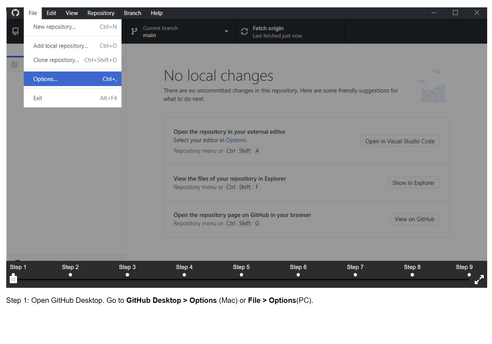
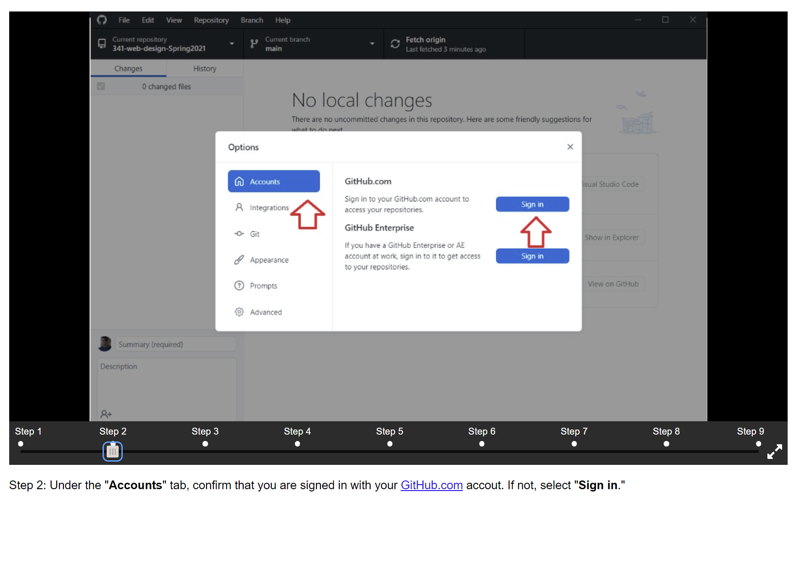
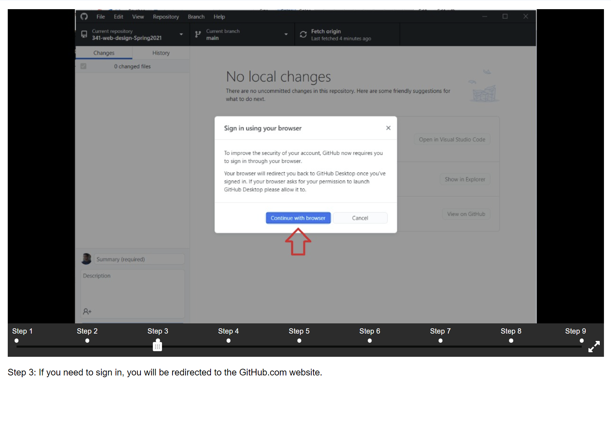
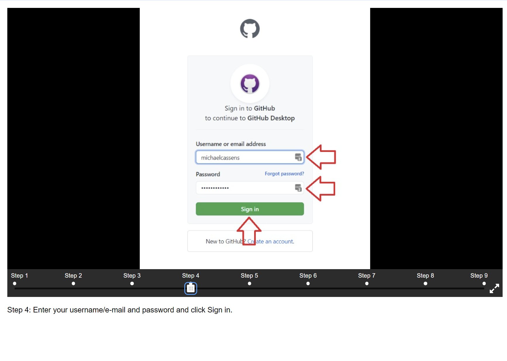
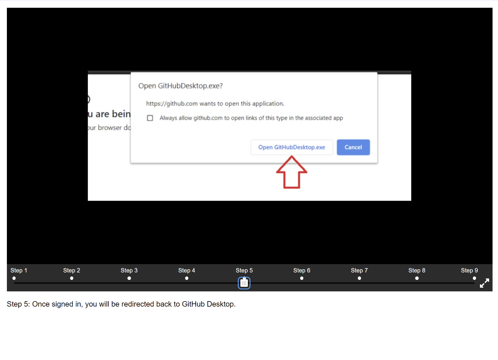
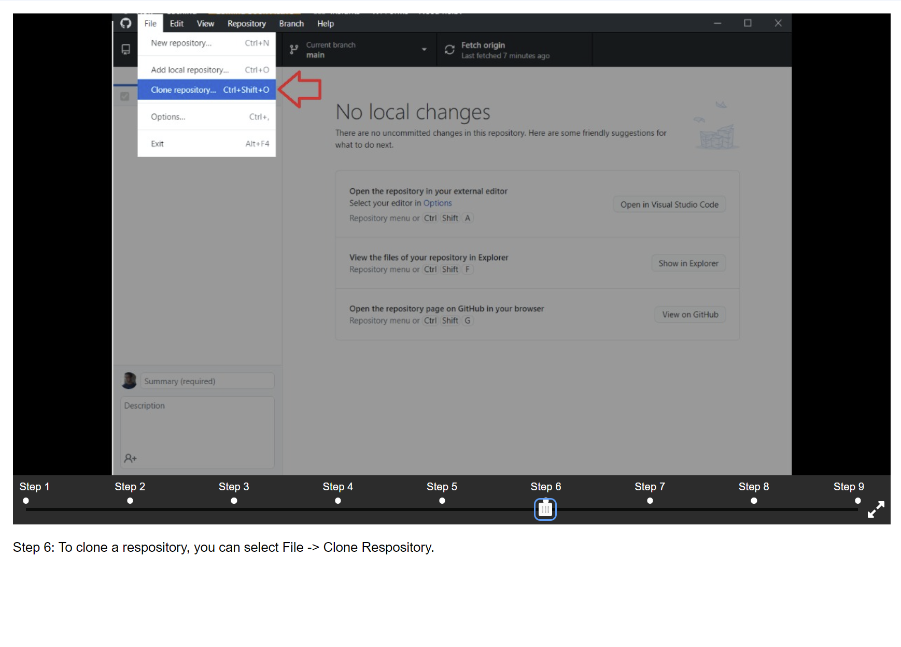
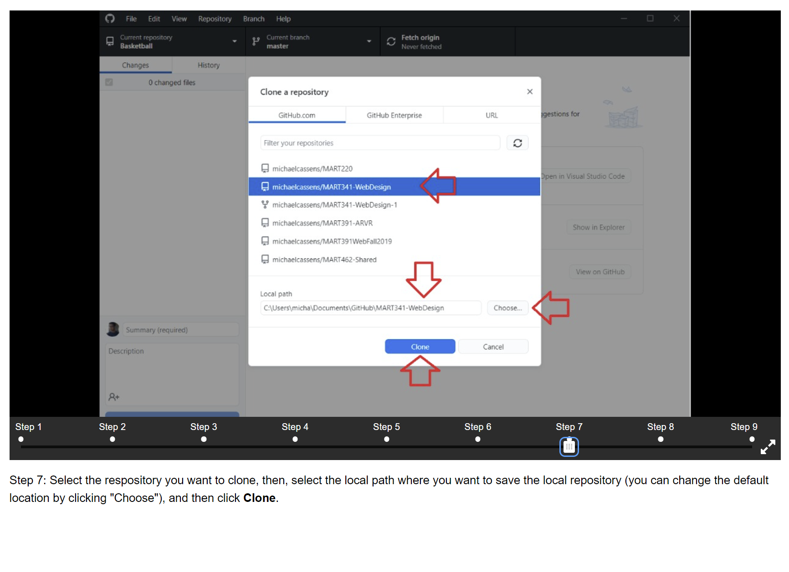
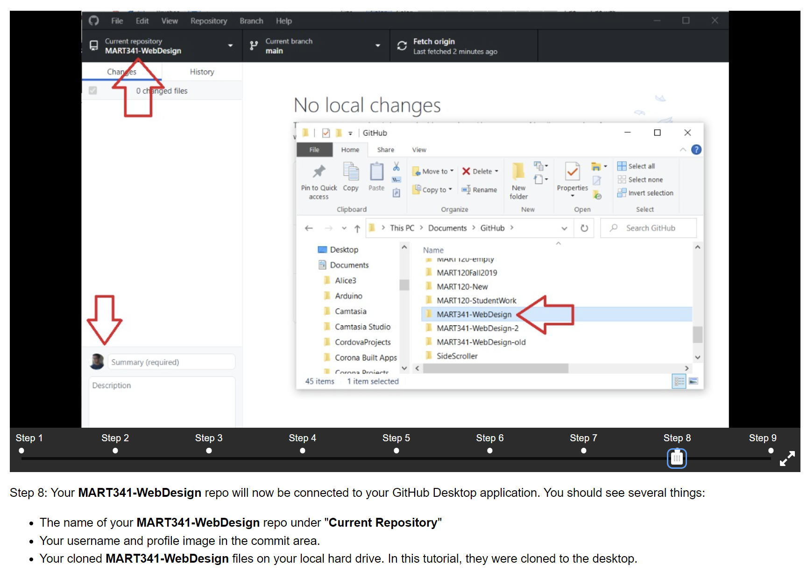
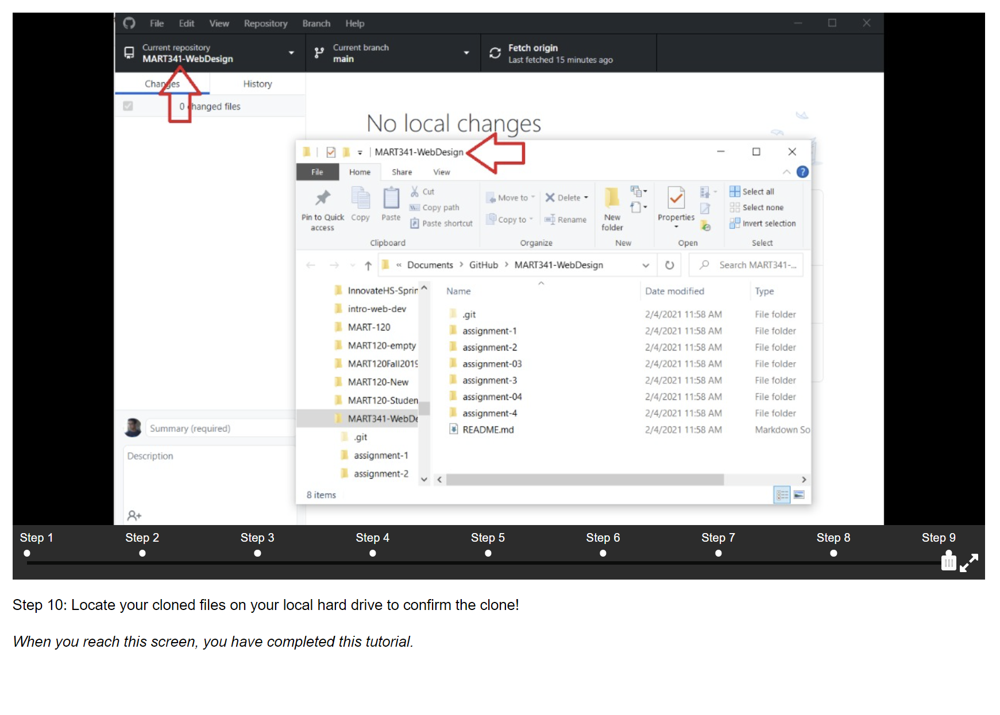

Load Time This page contains embedded interactive content. It may take 3-10 seconds to load completely.

**If the interactive content does not load on your computer, please scroll down to see the individual slides for this tutorial.**

In order to continue to work in our <a href="" target="_blank">GitHub.com</a> homework repository from your computer, we need to connect the two interfaces using the GitHub Desktop app.

<iframe src="https://umontanamediaarts.com/MART341/wp-admin/admin-ajax.php?action=h5p_embed&id=22" width="958" height="773" frameborder="0" allowfullscreen="allowfullscreen"></iframe><--->
<a href="https://umontanamediaarts.com/MART341/wp-admin/admin-ajax.php?action=h5p_embed&id=22" class="btn btn-default btn-xs" target="_blank">View Larger</a>

